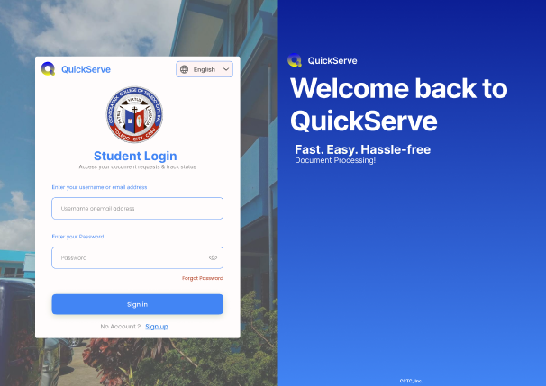
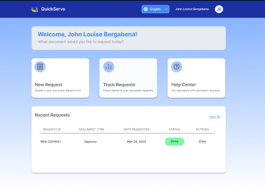
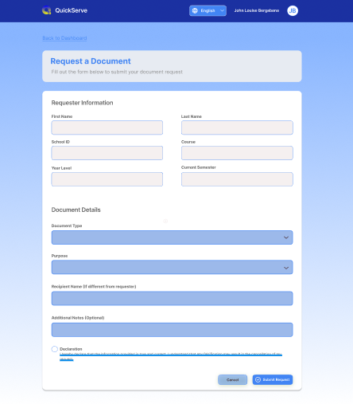

## Features
- User authentication (login/register)
- Document request submission
- Request status tracking with real-time updates
- Admin dashboard for request management
- Email notifications for status updates

## Real-time Updates
The application uses WebSocket for real-time status updates:
- Students receive instant notifications when their document status changes
- The requests list automatically updates without refreshing
- Connection status is logged in the browser console

## Pages

- Login Screen

- Dashboard

- Request Document Page
